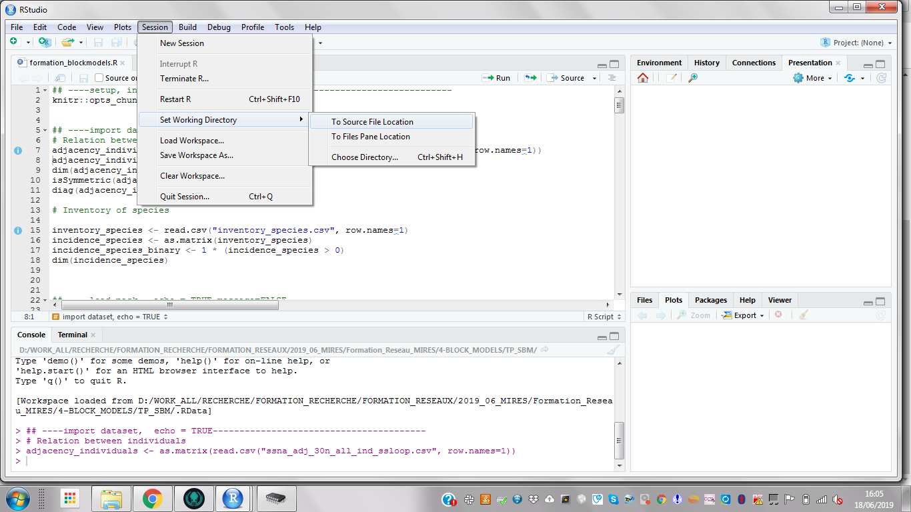
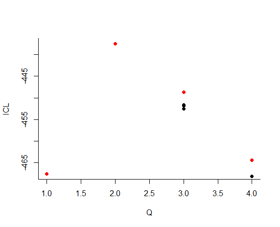
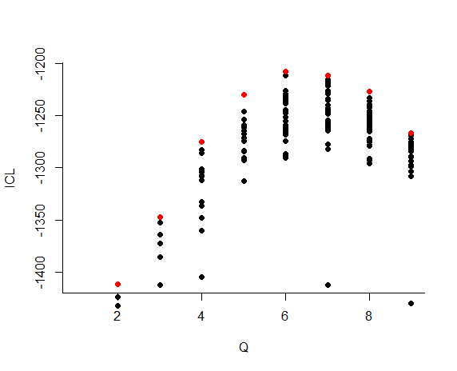
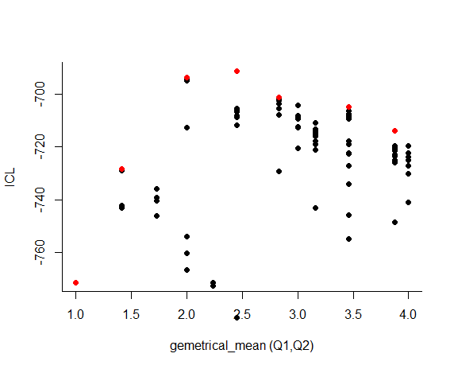
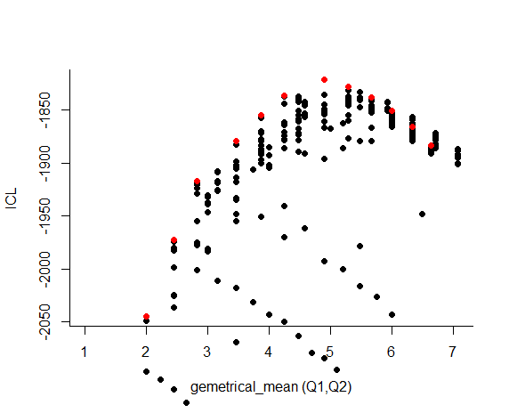

```{r setup, include=FALSE}
knitr::opts_chunk$set(echo = FALSE)
setwd("D:/WORK_ALL/RECHERCHE/FORMATION_RECHERCHE/FORMATION_RESEAUX/2019_06_MIRES/Formation_Reseau_MIRES/4-BLOCK_MODELS/TP_SBM")
```

- On commence par ouvrir le fichier *formation_blockmodels.r*. 
- Je choisis mon répertoire de travail. 




# Dataset : Vanuatu dataset. Sophie Caillon . 


```{r import dataset,  echo = TRUE}
# Relation between individuals 
adjacency_individuals <- as.matrix(read.csv("ssna_adj_30n_all_ind_ssloop.csv", row.names=1))
adjacency_individuals_binary <- 1 * (adjacency_individuals > 0)
dim(adjacency_individuals)
isSymmetric(adjacency_individuals_binary)
diag(adjacency_individuals_binary)

# Inventory of species 

inventory_species <- read.csv("inventory_species.csv", row.names=1)
incidence_species <- as.matrix(inventory_species)
incidence_species_binary <- 1 * (incidence_species > 0)
dim(incidence_species)

```


- $30$ individuals,  $37$ species
- "adjacency_individuals" : weighted individuals  interactions (number of seed exchanges) 
- "adjacency_individuals_binary" : binary individuals  interactions (seed exchanges yes (1) or no (0)) 
- "incidence_species " : weighted individuals - species interactions
- "incidence_species_binary " : binary individuals - species interactions

# Useful packages

- R-package blockmodels to infer Stochastic Block Model [SBM] and Latent Block model [LBM] on ecological networks
- We will also need the ggplot2, igraph and alluvial packages.

```{r load pack,  echo = TRUE,message=FALSE}
library(blockmodels)
library(igraph)
library(alluvial)
library(ggplot2)
```
- For this class, we wrote additional ad-hoc functions. They are in the following file: 
```{r source function,  echo = TRUE, message=FALSE}
source('function_for_blockmodels.R')
```


# Stochastic Block Model for Binary Network

## Dataset :  binary seed circulation network

We consider that two individuals are in interaction if they exchange at least one time.

- Plot of the adjacency matrix:

```{r  adjbin plot, echo=TRUE} 
plotMatrix(Mat = adjacency_individuals_binary,rowFG = 'individuals', colFG  = 'individuals')

```


## Model and inference

\begin{align*}
 (Z_i) \text{ i.i.d.} \qquad & Z_i \sim \mathcal{M}(1, \pi) \\
 (Y_{ij}) \text{ indep.} \mid (Z_i) \qquad & (Y_{ij} \mid Z_i=k, Z_j = \ell) \sim \mathcal{B}(\alpha_{k\ell})
\end{align*}


- Blockmodel : object programming
- First we define the object
```{r SBM, echo=TRUE, eval = TRUE}
sbm.bern <- BM_bernoulli("SBM",adjacency_individuals_binary)
```
"SBM"" indicates that the adjacency is not symmetric (undirected network), it is important to specify it for statistical reasons. If the matrix is symmetric (undirected network), we use BM_bernoulli("SBM_sym",adjacency_individuals_binary) instead.

- Then we apply the inference method
 
```{r estimate SBM, echo=TRUE, eval = FALSE}
sbm.bern$estimate()
```
```{r save SBM, echo=FALSE, eval = FALSE}
save(sbm.bern,file = 'res_sbm_bern.Rdata')
``` 


- The various points correspond to several runs of the estimation (resulting into a model selection criteria value) for a given number of clusters (denoted $Q$ here).
- We select the best number of clusters (with respect to the ICL criteria).
```{r  load SBM, echo=FALSE, eval = TRUE}
load(file = 'res_sbm_bern.Rdata')
```
```{r select SBM, echo=TRUE, eval = TRUE}
bestmodel = which.max(sbm.bern$ICL)
bestmodel
``` 


- We can now extract the parameters of interest, namely ($\alpha$, $\pi$) and the nodes (here individuals) clustering $Z$  
```{r extract param SBM, echo=TRUE, eval = TRUE}
paramEstimSBM.bern <- extractParamBM(sbm.bern,bestmodel)
paramEstimSBM.bern$pi
paramEstimSBM.bern$alpha
paramEstimSBM.bern$Z
```

- One can plot the reorganized matrix according to the clustering.

```{r plot org adj bin,  echo=TRUE, eval = TRUE}
plotMatrix(adjacency_individuals_binary,'individuals','individuals', fileNameSave = NULL, clustering = list(row = paramEstimSBM.bern$Z))
``` 

- Finally one can plot the macroview of the network.

```{r plot BM network adj,  echo=TRUE, eval = TRUE}
G <- graph_from_adjacency_matrix(paramEstimSBM.bern$alpha, mode = c("directed"), weighted = TRUE, diag = TRUE)
plot.igraph(G,vertex.size = paramEstimSBM.bern$pi*10,edge.width= abs(E(G)$weight)*2,vertex.color = 1:paramEstimSBM.bern$Q, layout = layout_nicely)
``` 


- The composition of the clusters/blocks are given by:  
```{r list names blocks,  echo=TRUE, eval = TRUE}
lapply(1:paramEstimSBM.bern$Q,function(q){rownames(adjacency_individuals_binary)[paramEstimSBM.bern$Z == q]})
```


#  SBM for Counting Network

## Dataset :  weighted individuals interactions

In the weighted individuals interactions network, each edge is valued with the number of exchanges.

- Plot of the adjacency matrix:

```{r  adj plot, echo=TRUE} 
plotMatrix(Mat = adjacency_individuals,rowFG = 'individual', colFG  = 'individual')
```

## Model and inference
We consider the SBM Poisson model.

\begin{align*}
 (Z_i) \text{ i.i.d.} \qquad & Z_i \sim \mathcal{M}(1, \pi) \\
 (Y_{ij}) \text{ indep.} \mid (Z_i) \qquad & (Y_{ij} \mid Z_i=k, Z_j = \ell) \sim \mathcal{P}(\exp(\alpha_{kl})) = \mathcal{P}(\lambda_{kl})
\end{align*}

```{r SBM Poisson, echo=TRUE, eval = TRUE}
sbm.poiss <- BM_poisson("SBM",adjacency_individuals)
```

- Then we apply the inference method
 
```{r estimate SBM poisson, echo=TRUE, eval = FALSE}
sbm.poiss$estimate()
save(sbm.poiss,file = 'res_sbm_poiss.Rdata')
```


- We select the best number of clusters (with respect to the ICL criteria)
```{r sload SBM poisson,echo=FALSE, eval =TRUE}
load('res_sbm_poiss.Rdata')
```


```{r select SBM poisson, echo=TRUE, eval = TRUE}
Q = which.max(sbm.poiss$ICL)
Q
``` 

- We can now extract the parameters of interest, namely ($\lambda$, $\pi$) and the clustering of the nodes. 
```{r extract param SBM poisson, echo=TRUE, eval = TRUE}
paramEstimSBM.pois <- extractParamBM(sbm.poiss,Q)
paramEstimSBM.pois$pi
paramEstimSBM.pois$lambda
paramEstimSBM.pois$Z
```

- One can plot the reorganized matrix according to the clustering.

```{r plot org  ,  echo=TRUE, eval = TRUE}
plotMatrix(adjacency_individuals,'individuals','individuals', fileNameSave = NULL, clustering = list(row = paramEstimSBM.pois$Z))
``` 

- One can plot the macroview of the network.


```{r plot BM network  poisson, echo=TRUE, eval = TRUE}
G <- graph_from_adjacency_matrix(paramEstimSBM.pois$lambda, mode = c("undirected"), weighted = TRUE, diag = TRUE)
plot.igraph(G,vertex.size=paramEstimSBM.pois$pi*100,edge.width=abs(E(G)$weight)*0.5,vertex.color=1:paramEstimSBM.pois$Q, layout=layout_nicely)
``` 

- The composition of the clusters/blocks are given by :  
```{r list names blocks Poisson,  echo=TRUE, eval = TRUE}
lapply(1:paramEstimSBM.pois$Q,function(q){rownames(adjacency_individuals_binary)[paramEstimSBM.pois$Z == q]})
```

We are interested in comparing the two cluterings. To do so we use the alluvial flow plots.

```{r alluvial, echo=TRUE,eval=TRUE}
A <- as.data.frame(table(paramEstimSBM.bern$Z,paramEstimSBM.pois$Z))
colnames(A)=c('SBM Bern',"SBM Poisson","Freq")
w   <- which(A$Freq!=0)
A <- A[w,]
alluvial(A[,c(1,2)],freq=A$Freq)
```


# Latent Block model 

## Dataset : individuals/species interactions

- Plot of the incidence matrix

```{r  incidence plot, echo=TRUE} 
plotMatrix(Mat = incidence_species_binary,rowFG = 'individuals', colFG  = 'species')
```

We can know try to get a clustering of individuals and species conjointly. 

## Model and inference 

\begin{align*}
 (Z^R_i) \text{ i.i.d.} \qquad & Z^R_i \sim \mathcal{M}(1, \pi^R) \\
  (Z^C_i) \text{ i.i.d.} \qquad & Z^C_i \sim \mathcal{M}(1, \pi^C) \\

 (Y_{ij}) \text{ indep.} \mid (Z^R_i, Z^C_j) \qquad & (Y_{ij} \mid Z^R_i=k, Z^C_j = \ell) \sim \mathcal{B}(\alpha_{k\ell})
\end{align*}


```{r LBM,echo=TRUE,eval=FALSE}
lbm_bern <- BM_bernoulli("LBM",incidence_species_binary)
lbm_bern$estimate()
```
```{r LBM save,echo=FALSE,eval=FALSE}
save(lbm_bern,file = 'res_lbm_bern.Rdata')
``` 

```{r LBM load,echo=FALSE,eval=TRUE}
load(file = 'res_lbm_bern.Rdata')
``` 




- We select the best number of clusters (with respect to the ICL criteria)
```{r select lBM  , echo=TRUE, eval = TRUE}
BestModel = which.max(lbm_bern$ICL) 
BestModel 
paramEstimLBM_bern <- extractParamBM(lbm_bern,BestModel )
paramEstimLBM_bern$Q

```

- We can extract the parameters of interest, namely ($\alpha$, $\pi$) and the clustering of the nodes. 
```{r extract param LBM, echo=TRUE, eval = TRUE}
paramEstimLBM_bern$piRow
paramEstimLBM_bern$piCol
paramEstimLBM_bern$alpha
paramEstimLBM_bern$ZRow
paramEstimLBM_bern$ZCol
```


```{r plot org  incidence,  echo=TRUE, eval = TRUE}
plotMatrix(incidence_species_binary,'individuals','species', fileNameSave = NULL, clustering = list(row = paramEstimLBM_bern$ZRow,col = paramEstimLBM_bern$ZCol))
``` 
```{r plot BM network incidence,  echo=TRUE, eval = TRUE}
G <- graph_from_incidence_matrix(paramEstimLBM_bern$alpha, weighted = TRUE)
plot(G,vertex.size=c(paramEstimLBM_bern$piRow*100, paramEstimLBM_bern$piCol*100), vertex.shape=c("circle", "square")[V(G)$type +1], edge.width=abs(E(G)$weight*2),vertex.color=1:sum(paramEstimLBM_bern$Q), layout=layout.bipartite)
``` 

- Exercise : give the name list of the various clusters. 


# Latent Block model  for weighted networks

## Dataset : individuals-species  interactions
In the individuals-species interactions network, an edge indicates if an individual cultivates a species. 

- Plot of the incidence matrix

```{r  incidence plot , echo=TRUE} 
plotMatrix(Mat = incidence_species,rowFG = 'individuals', colFG  = 'species')
```

We can now try to get a clustering of individuals and species  conjointly. 

## Model and inference 

\begin{align*}
 (Z^R_i) \text{ i.i.d.} \qquad & Z^R_i \sim \mathcal{M}(1, \pi^R) \\
  (Z^C_i) \text{ i.i.d.} \qquad & Z^C_i \sim \mathcal{M}(1, \pi^C) \\

 (Y_{ij}) \text{ indep.} \mid (Z^R_i, Z^C_j) \qquad & (Y_{ij} \mid Z^R_i=k, Z^C_j = \ell) \sim \mathcal{P}(\alpha_{k\ell})
\end{align*}


```{r LBM pois,echo=TRUE,eval=FALSE}
lbm_pois <- BM_poisson("LBM",incidence_species)
lbm_pois$estimate()
```
```{r LBM pois save,echo=FALSE,eval=FALSE}
save(lbm_pois,file = 'res_lbm_pois.Rdata')
``` 

```{r LBM pois load,echo=FALSE,eval=TRUE}
load(file = 'res_lbm_pois.Rdata')
``` 




- We select the best number of clusters (with respect to the ICL criteria)
```{r select lBM pois, echo=TRUE, eval = TRUE}
BestModel = which.max(lbm_pois$ICL) 
BestModel 
paramEstimLBM_pois <- extractParamBM(lbm_pois,BestModel )
paramEstimLBM_pois$Q

```

- We can extract the parameters of interest, namely ($\alpha$, $\pi$) and the clustering of the nodes. 
```{r extract param LBM pois, echo=TRUE, eval = TRUE}
paramEstimLBM_pois$piRow
paramEstimLBM_pois$piCol
paramEstimLBM_pois$alpha
paramEstimLBM_pois$ZRow
paramEstimLBM_pois$ZCol
```

```{r plot org  lbm pois,  echo=TRUE, eval = TRUE}
plotMatrix(incidence_species,'individuals','species', fileNameSave = NULL, clustering = list(row = paramEstimLBM_pois$ZRow,col = paramEstimLBM_pois$ZCol))
``` 
```{r plot BM network pois,  echo=TRUE, eval = TRUE}
G <- graph_from_incidence_matrix(paramEstimLBM_pois$alpha, weighted = TRUE)
plot(G,vertex.size = c(paramEstimLBM_pois$piRow*100, paramEstimLBM_pois$piCol * 100), vertex.shape = c("circle", "square")[V(G)$type + 1], edge.width=abs(E(G)$weight * 2),vertex.color = 1:sum(paramEstimLBM_pois$Q), layout = layout.bipartite)
``` 

